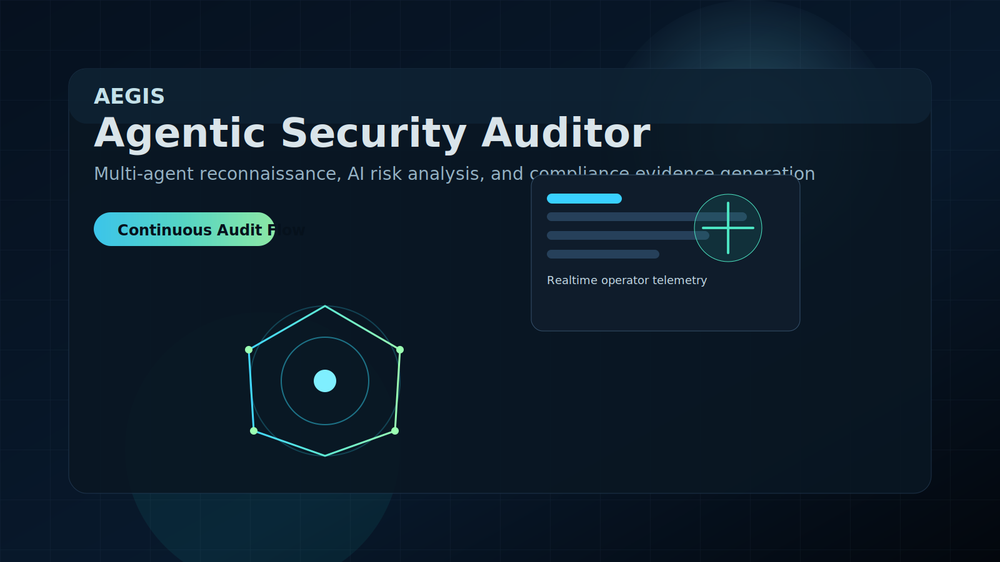
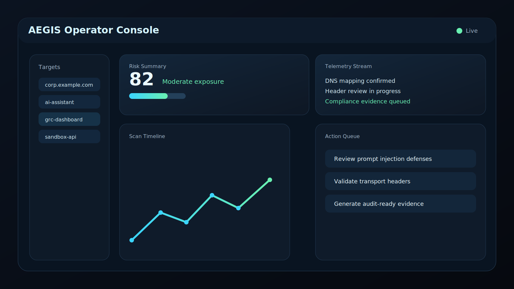
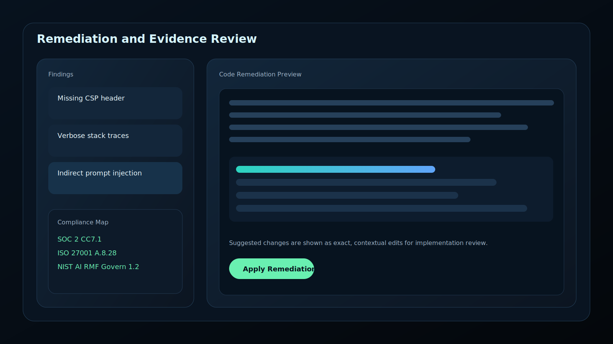

# AEGIS Agentic Security Auditor & Threat Simulation Engine

  

This repository is a portfolio showcase for AEGIS, a conceptual multi-agent security auditing and GRC automation platform. The repo does not include the private production application, so the visuals below are project-specific screenshot-style mockups generated to match the product story.

## Overview

AEGIS is presented as a coordinated security workflow for:

- passive reconnaissance
- transport and header review
- AI-specific risk analysis
- compliance evidence generation
- remediation guidance

## Dashboard View

  

The dashboard mockup shows the operator console, live status cards, telemetry stream, and scan summary panels that fit the product description in the repo.

## Remediation View

  

The remediation mockup highlights finding details, code-level guidance, and compliance mapping in a single review surface.

## Notes

- The visuals are local SVG files committed in this repository.
- The design is intentionally aligned to the AEGIS security and compliance narrative.
- If you want true screenshots from a runnable app, I would need the actual application source or a build I can run locally.

## Contact

- GitHub: [TokeATJ](https://github.com/TokeATJ)
- Email: [tokeatijosan1@gmail.com](mailto:tokeatijosan1@gmail.com)
