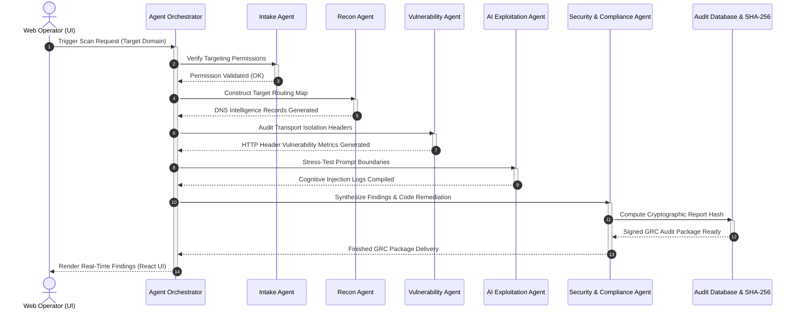

# Dynamic Agent Orchestration Loop

This diagram models the message patterns and coordination states between active agents during an audit run.

```mermaid
sequenceDiagram
    autonumber
    actor Operator as Web Operator (UI)
    participant Orchestrator as Agent Orchestrator
    participant Intake as Intake Agent
    participant Recon as Recon Agent
    participant Vuln as Vulnerability Agent
    participant Exploit as AI Exploitation Agent
    participant Compliance as Security & Compliance Agent
    participant DB as Audit Database & SHA-256

    Operator->>Orchestrator: Trigger Scan Request (Target Domain)
    activate Orchestrator
    
    Orchestrator->>Intake: Verify Targeting Permissions
    activate Intake
    Intake-->>Orchestrator: Permission Validated (OK)
    deactivate Intake
    
    Orchestrator->>Recon: Construct Target Routing Map
    activate Recon
    Recon-->>Orchestrator: DNS Intelligence Records Generated
    deactivate Recon
    
    Orchestrator->>Vuln: Audit Transport Isolation Headers
    activate Vuln
    Vuln-->>Orchestrator: HTTP Header Vulnerability Metrics Generated
    deactivate Vuln
    
    Orchestrator->>Exploit: Stress-Test Prompt Boundaries
    activate Exploit
    Exploit-->>Orchestrator: Cognitive Injection Logs Compiled
    deactivate Exploit
    
    Orchestrator->>Compliance: Synthesize Findings & Code Remediation
    activate Compliance
    Compliance->>DB: Compute Cryptographic Report Hash
    activate DB
    DB-->>Compliance: Signed GRC Audit Package Ready
    deactivate DB
    Compliance-->>Orchestrator: Finished GRC Package Delivery
    deactivate Compliance
    
    Orchestrator-->>Operator: Render Real-Time Findings (React UI)
    deactivate Orchestrator
```
