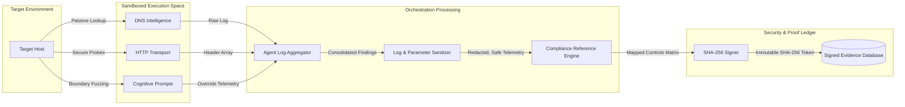

# GRC Audit Data Flow

This diagram traces the flow of audit telemetry from the target target to the finalized, cryptographically-signed compliance evidence report.

```mermaid
graph LR
    subgraph Target_Space [Target Environment]
        Host[Target Host]
    end

    subgraph Isolation_Sandbox [Sandboxed Execution Space]
        DNS[DNS Intelligence]
        HTTP[HTTP Transport]
        AI[Cognitive Prompts]
    end

    subgraph Processing [Orchestration Processing]
        Aggregator[Agent Log Aggregator]
        Sanitizer[Log & Parameter Sanitizer]
        GRCMapper[Compliance Reference Engine]
    end

    subgraph Security_Storage [Security & Proof Ledger]
        HashEngine[SHA-256 Signer]
        ProofStorage[(Signed Evidence Database)]
    end

    %% Flow lines
    Host -->|Passive Lookup| DNS
    Host -->|Secure Probes| HTTP
    Host -->|Boundary Fuzzing| AI

    DNS -->|Raw Log| Aggregator
    HTTP -->|Header Array| Aggregator
    AI -->|Override Telemetry| Aggregator

    Aggregator -->|Consolidated Findings| Sanitizer
    Sanitizer -->|Redacted, Safe Telemetry| GRCMapper
    
    GRCMapper -->|Mapped Controls Matrix| HashEngine
    HashEngine -->|Immutable SHA-256 Token| ProofStorage
```
