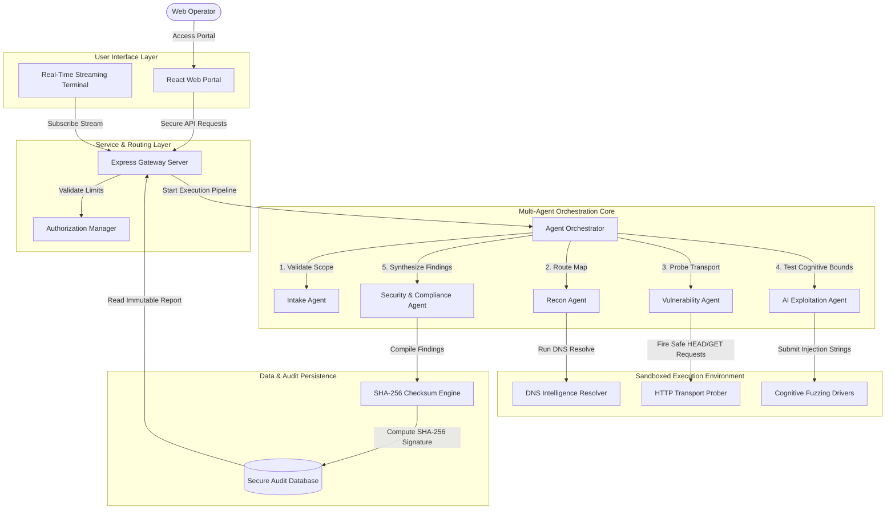

# System Architecture Model

This diagram maps the high-level services, databases, and message orchestration pathways of the **Agentic AI Security Audit Platform**.

```mermaid
graph TD
    %% Define Nodes
    Operator([Web Operator])
    
    subgraph UI_Layer [User Interface Layer]
        ReactApp[React Web Portal]
        Telemetry[Real-Time Streaming Terminal]
    end

    subgraph Service_Layer [Service & Routing Layer]
        API[Express Gateway Server]
        AuthEngine[Authorization Manager]
    end

    subgraph Agent_Core [Multi-Agent Orchestration Core]
        Orchestrator[Agent Orchestrator]
        IntakeAgent[Intake Agent]
        ReconAgent[Recon Agent]
        VulnAgent[Vulnerability Agent]
        ExploitAgent[AI Exploitation Agent]
        ComplianceAgent[Security & Compliance Agent]
    end

    subgraph Sandboxed_Tools [Sandboxed Execution Environment]
        DNSUtils[DNS Intelligence Resolver]
        HTTPProber[HTTP Transport Prober]
        FuzzDriver[Cognitive Fuzzing Drivers]
    end

    subgraph Memory_Layer [Data & Audit Persistence]
        DB[(Secure Audit Database)]
        CryptoEngine[SHA-256 Checksum Engine]
    end

    %% Define Connections
    Operator -->|Access Portal| ReactApp
    ReactApp -->|Secure API Requests| API
    Telemetry -->|Subscribe Stream| API
    
    API -->|Validate Limits| AuthEngine
    API -->|Start Execution Pipeline| Orchestrator
    
    Orchestrator -->|1. Validate Scope| IntakeAgent
    Orchestrator -->|2. Route Map| ReconAgent
    Orchestrator -->|3. Probe Transport| VulnAgent
    Orchestrator -->|4. Test Cognitive Bounds| ExploitAgent
    Orchestrator -->|5. Synthesize Findings| ComplianceAgent
    
    ReconAgent -->|Run DNS Resolve| DNSUtils
    VulnAgent -->|Fire Safe HEAD/GET Requests| HTTPProber
    ExploitAgent -->|Submit Injection Strings| FuzzDriver
    
    ComplianceAgent -->|Compile Findings| CryptoEngine
    CryptoEngine -->|Compute SHA-256 Signature| DB
    DB -->|Read Immutable Report| API
```
