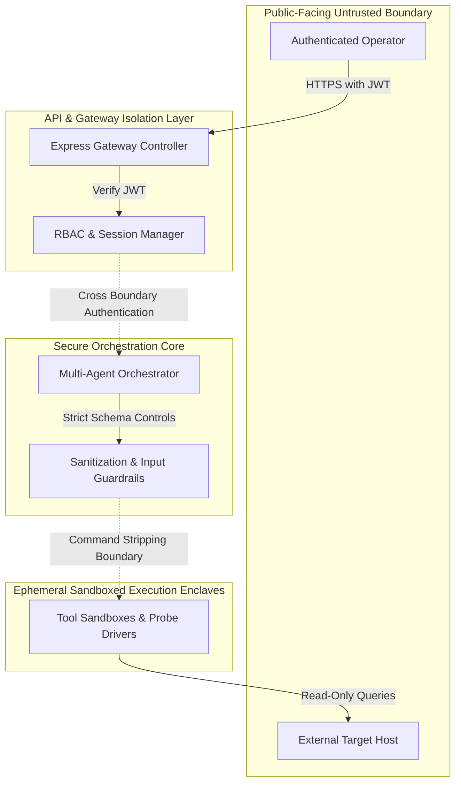

# System Trust Boundaries & Isolation

This diagram illustrates the security isolation boundaries that separate public access layers, administrative control layers, and execution modules.

```mermaid
graph TD
    subgraph Public_Domain [Public-Facing Untrusted Boundary]
        User[Authenticated Operator]
        Target[External Target Host]
    end

    subgraph DMZ_Layer [API & Gateway Isolation Layer]
        Express[Express Gateway Controller]
        SessionEngine[RBAC & Session Manager]
    end

    subgraph Secure_VPC [Secure Orchestration Core]
        Orchestrator[Multi-Agent Orchestrator]
        Policies[Sanitization & Input Guardrails]
    end

    subgraph Isolated_Enclaves [Ephemeral Sandboxed Execution Enclaves]
        Workers[Tool Sandboxes & Probe Drivers]
    end

    %% Boundaries (defined by flows)
    User -->|HTTPS with JWT| Express
    Express -->|Verify JWT| SessionEngine
    
    SessionEngine -.->|Cross Boundary Authentication| Orchestrator
    Orchestrator -->|Strict Schema Controls| Policies
    
    Policies -.->|Command Stripping Boundary| Workers
    Workers -->|Read-Only Queries| Target
```
